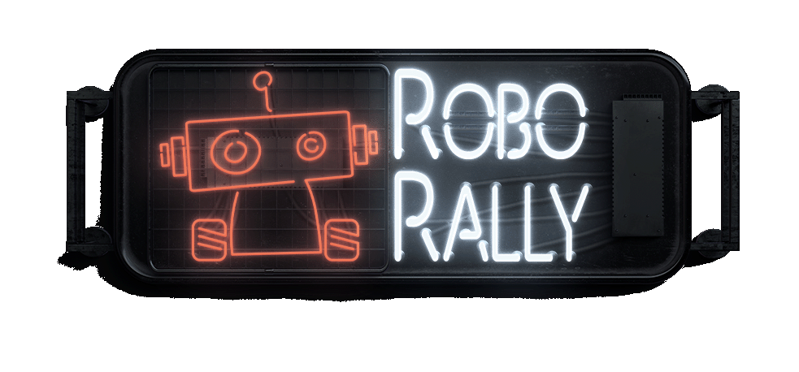

# Roborally - Kursive Kationen

## Getting Started

These instructions will help you run our version of **Roborally** on your local computer.

## JAR Files
1. The Jar files are located [here](../roborally/target)
1. Open the Server's jar file using: java -jar Server-jar-with-dependencies.jar -p PORTNUMBER
2. Open the User's jar file using: java -jar User-jar-with-dependencies.jar -u player -h localhost -p PORTNUMBER
    - if the above command doesn't work try: java -jar --module-path "PathToJavaFXLibFolder" --add-modules javafx.controls,javafx.fxml User-jar-with-dependencies.jar -u player -h localhost -p PORTNUMBER)

    ***Repeat 2 until you get the desired number of players.***

## User Interface

### Connecting to Server

Click: “Connect to server”. If you want to play with the KI, place the check mark in the white box.

### Lobby

1. Type in your name and click “Choose username”.
2. Select your robot by clicking on it.
3. Click on “Submit selections”.
4. Click on “Ready to play!”.
5. If you are the first one ready, you can select the racing course in the dropdown-menu and then confirm your selection by clicking on the green check mark.
6. If enough players are ready, the game starts. There are four buttons on the left side.

### Game

1. Green robot button: amount of energy cubes and reached checkpoints.
2. Purple register button: played cards.
3. Pink speech bubbles button: chat.
4. Blue arrow button (only visible in the activation phase): plays the card.

#### Cheats:

**The following commands can be typed in the chat of the robot you want to cheat with:** 

*#MoveI*, *#MoveII*, *#MoveIII*, *#BackUp*, *#TurnRight*, *#TurnLeft*, *#UTurn*, *#PowerUp*, *#Spam*, *#Virus*, *#TrojanHorse*, *#Worm*, 
*#TeleportX (For X you type the position of the field you want to go to (0-129))*

## JavaDocs
Click [here](../roborally/src/main/resources/JavaDocs)
